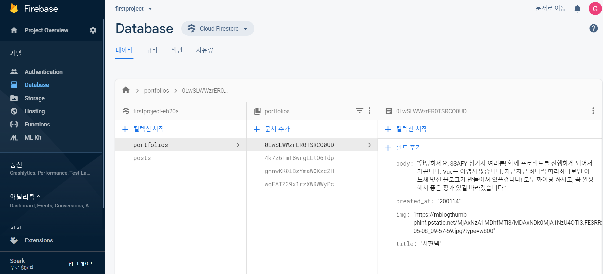
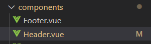

# 반응형 단일 페이지 애플리케이션 구현

* 소개
  * 단일 페이지 애플리케이션 구현
  * 반응형 웹(Responsive Web) 구현
  * Vue와 Vuetify를 이용하여 사용자 친화적이고 다양한 디바이스에 최적한 된 웹 구현
* 환경
  * VisualStudioCode
  * Vue
  * Vuetify
  * Firebase

## 개발 구동 및 빌드 관련

## 1. 스켈레톤 프로젝트 개발 환경 설정

* package-lock.json 지우기

  ```bash
  $ rm package-lock.json
  ```

* npm 설치

  ```bash
  $ npm install
  ```

* npm 빌드

  ```bash
  $ npm run build
  ```

  서버에 배포하기 전 반드시 build를 해야함. build를 통해 서버에 전송할 것들을 정리하는 것.


## 2. Firebase 연동

* firebase 초기화

  ```bash
  $ firebase init
  ```

* firebase 배포

  ```bash
  $ firebase deploy
  ```

* firebase의 database에서 원하는 자료 추가

  

  컬렉션에 vue의 FirebaseService에 저장된 변수명으로 컬렉션 만들어야 함

  문서에 추가하는 필드명도 vue의 components에 저장된 변수명으로 만들어야 함


## 3. About Me 리사이징

views/Homepage.vue

```vue
<v-layout my-5>
        <v-flex col-sm-8 col-12 text-sm-left text-center>
          <h2 class="headline mb-3">About Me</h2>
          <p class="mr-4">안녕하세요, SSAFY 참가자 여러분!<br/>함께 프로젝트를 진행하게 되어서 기쁩니다. Vue는 어렵지 않습니다. 차근차근 하나씩 따라하다보면 어느새 멋진 블로그가
            만들어져 있을겁니다! 모두 화이팅 하시고, 꼭 완성해서 좋은 평가 있길 바라겠습니다.</p>
        </v-flex>
        <v-flex xs4 d-none d-sm-flex>
          <v-img :src="getImgUrl('130dpi.jpg')" aspect-ratio="1.5"/>
        </v-flex>
      </v-layout>
```

col-sm-8을 통해 화면이 sm 사이즈일 때 8개의 그리드 공간을 차지하게 함

d-none을 통해 모바일 사이즈일 때는 이미지를 보여주지 않는다.

```txt
.d-{value} for xs
.d-{breakpoint}-{value} for sm, md, lg, and xl.
```


## 4. Portfolio 리사이징

### components/PortfolioList.vue

```vue
<v-flex v-for="i in portfolios.length > limits ? limits : portfolios.length" xs12 sm6 lg3  :key="i">
      <Portfolio class="ma-3"
              :date="portfolios[i - 1].created_at.toString()"
              :title="portfolios[i - 1].title"
              :body="portfolios[i - 1].body"
              :imgSrc="portfolios[i - 1].img"
      ></Portfolio>
    </v-flex>
```

xs12 sm6 lg3 를 통하여 화면 사이즈 별로 몇 개의 데이터를 표현할지 나타냄


```js
export default {
	name: 'PortfoliosList',
	props: {
		limits: {type: Number, default: 4},
    loadMore: {type: Boolean, default: false}
	},
    ...
}
```

limit를 3에서 4로 바꾸어서 v-for에서 불러오는 데이터를 개수를 늘림


### components/Portfolio.vue

```vue
<v-card>
    <v-img :src="imgSrc" height="200px">
    </v-img>
    <v-card-title primary-title>
      <div>
        <div class="headline limitporttitle">{{title}}</div>
        <span class="grey--text limitportbody">{{body}}</span>
      </div>
    </v-card-title>
  </v-card>
```

div와 span 클래스에 각각 limitporttitle, limitportbody를 설정하여 css에서 설정을 변경할 수 있게 설정

```css
<style>
  .limitporttitle {
    font-family: sans-serif;
    font-size: 24px;
    line-height: 1.2;
    max-height: 1.2em;
    overflow: hidden;
    display: -webkit-box;
    -webkit-line-clamp: 1;
    -webkit-box-orient: vertical;
  }
  .limitportbody{
    font-family: sans-serif;
    font-size: 16px;
    line-height: 1.2;
    max-height: 4.8em;
    overflow: hidden;
    display: -webkit-box;
    -webkit-line-clamp: 4;
    -webkit-box-orient: vertical;
  }
</style>
```

line-height를 통해 한 줄의 높이 설정


## 5. 이미지 배너 리사이징

views/Homepage.vue

```vue
<ImgBanner imgSrc="https://source.unsplash.com/5brvJbR1Pn8/1600x900" style="width:100%">
      <div style="font-size:5vw; line-height:1.2em; text-align:center;" slot="text">후회하지 않는 삶을 살자</div>
    </ImgBanner>
```

width: 100% 설정을 통해 사이즈 조절


## 6. 네비게이션 바

components/Header.vue

```vue
<v-toolbar dense>
            <span class="hidden-sm-and-up">
                <v-app-bar-nav-icon @click.stop ="drawer = !drawer">
                    <v-icon>{{ "menu" }}</v-icon>
                </v-app-bar-nav-icon>
            </span>
            
            <v-toolbar-title>
                <router-link to="/" tag="span" style="cursor: pointer">
                    {{ appTitle }}
                </router-link>
            </v-toolbar-title>

            <v-spacer></v-spacer>
            <v-toolbar-items class="hidden-xs-only">
                <v-btn text v-for="item in menuItems" :key="item.title" :to="item.path">
                    <v-icon left dark>{{ item.icon }}</v-icon>
                    {{ item.title }}
                </v-btn>
            </v-toolbar-items>
        </v-toolbar>
```


## 7. 모바일용 사이드 바

components/Header.vue

```vue
<v-navigation-drawer v-model="drawer" app disable-resize-watcher>
            <v-list-item>
                <v-list-item-content>
                    <v-list-item-title class="title">
                        {{ appTitle }}
                    </v-list-item-title>
                </v-list-item-content>
            </v-list-item>
            <v-divider></v-divider>
            <v-list dense nav>
                <v-list-item v-for="item in sideItems" :key="item.title" :to="item.path" link>
                    <v-list-item-icon>
                        <v-icon>{{ item.icon }}</v-icon>
                    </v-list-item-icon>

                    <v-list-item-content>
                        <v-list-item-title>{{ item.title }}</v-list-item-title>
                    </v-list-item-content>
                </v-list-item>
            </v-list>
        </v-navigation-drawer>
```


## 8. 커스터마이징

* About Me 이미지 변경

  src/assets 에 원하는 이미지 추가(ex 130dpi.jpg)

  views/Homepage.vue에서 수정

  ```vue
  <v-flex xs4 d-none d-sm-flex>
            <v-img :src="getImgUrl('130dpi.jpg')" aspect-ratio="1.5"/>
          </v-flex>
  ```

  

* 이미지 배너 텍스트 변경

  views/Homepage에서 수정

  ```vue
  <ImgBanner imgSrc="https://source.unsplash.com/5brvJbR1Pn8/1600x900" style="width:100%">
        <div style="font-size:5vw; line-height:1.2em; text-align:center;" slot="text">후회하지 않는 삶을 살자</div>
      </ImgBanner>
  ```

  

* Favicon 변경

  [favicon 제작 사이트](https://www.favicon-generator.org/)에서 원하는 이미지 추가하여 제작

  제작된 결과를 public/img\icons에 추가하여 파일 변경

  


## 9. 구조 변경

* 네비게이션 영역의 컴포넌트 분리

  

* 포스트 및 포트폴리오 타이틀 및 설명 출력 설정

  

* Git 저장소 이름 줄 바꿈 설정 변경


## 10. Frontend 배포

1.  npm run build
2. firebase init
3. firebase deploy

